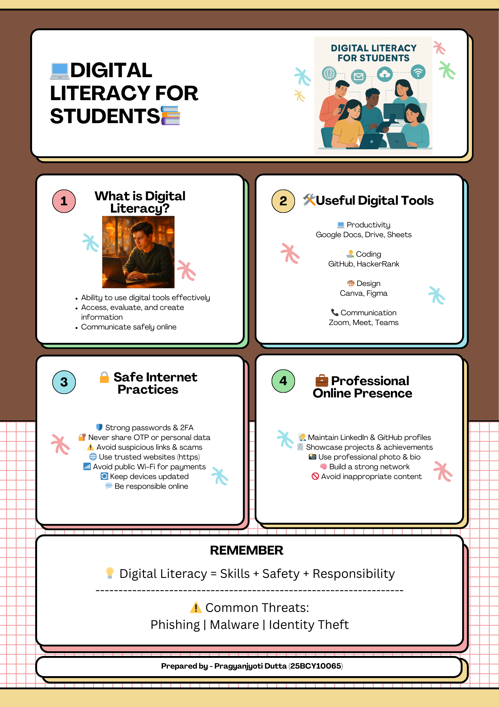

# Digital Literacy Project

**Name:** Pragyanjyoti Dutta  
**Reg No:** 25BCY10065  
**Branch:** Cybersecurity and Digital Forensics  
**Year:** 1st Year  

---

## 📌 Project Overview
This project was completed as part of the CSE0001 Digital Literacy course. It focuses on building essential digital skills such as creating a professional online presence, effective communication, using collaboration tools, and understanding cyber safety practices.

---

## 📂 Project Structure

### 🔹 Task 1 – Digital Literacy Infographic
Created an infographic using Canva covering digital literacy concepts, tools, safe internet practices, and professional presence.



---

### 🔹 Task 2 – Digital Portfolio
Created and updated professional profiles on:
- GitHub  
- LinkedIn  
- Kaggle  

Screenshots are included in the repository.

---

### 🔹 Task 3 – Platforms
- Solved a beginner-level coding problem on HackerRank  
- Created a Google Form titled **"Digital Literacy Awareness Quiz"**

🔗 Google Form Link: https://docs.google.com/forms/d/e/1FAIpQLScwhktqjYmczrsiI1TNPoVG2sjZWEQrDG2JhOVcnWsIXk9S3Q/viewform?usp=dialog

---

### 🔹 Task 4 – Email Etiquette
- Drafted two professional emails  
- Created a social media do’s and don’ts checklist  

---

### 🔹 Task 5 – Cybercrime Awareness
- Developed a phishing attack case study  
- Created a prevention checklist with safety tips  

---

## 🎯 Learning Outcomes
- Improved understanding of digital tools and platforms  
- Learned professional communication skills  
- Gained awareness about cyber threats and prevention  
- Built a basic digital portfolio  

---

## 📁 Repository Structure
## 📁 Repository Structure

```
digital-literacy-project/
│
├── README.md
├── report/
│   └── Project_Report.pdf
│
├── task-1-presentation/
│   └── infographic.png
│
├── task-2-portfolio/
│   ├── github-profile.png
│   ├── linkedin-profile.png
│   └── kaggle-profile.png
│
├── task-3-platforms/
│   ├── hackerrank-code.png
│   ├── hackerrank-output.png
│   ├── google-form.png
│   └── google-sheet.png
│
├── task-4-email-etiquette/
│   ├── email-1.txt
│   ├── email-2.txt
│   └── social-media-checklist.md
│
├── task-5-cybercrime/
│   ├── casestudy.md
│   └── prevention-checklist.md
```
